# Digital Legal Aid System (DLAS)

Legal aid for a district office in Bangladesh, from the first phone call to the officer's
decision.

A person calls a hotline and an AI listens, verifies who they are against the National ID
registry, and files the case. The District Legal Aid Officer (DLAO) confirms the AI's marks,
both sides hear by SMS, courts and jails can apply on behalf of people before them, a panel
lawyer takes the case to court and reports back, and every step is audited.

**Contents**

- [Modules at a glance](#modules-at-a-glance)
- [System architecture](#system-architecture)
- [Module by module](#module-by-module)
- [How a case moves](#how-a-case-moves)
- [Case lifecycle diagrams](#case-lifecycle-diagrams)
- [Run everything locally](#run-everything-locally)
- [Testing and quality checks](#testing-and-quality-checks)
- [Configuration](#configuration)
- [Repository layout](#repository-layout)
- [Troubleshooting](#troubleshooting)

## Modules at a glance

| Part | What it is | Stack | Port |
| --- | --- | --- | --- |
| [`server/`](server/README.md) | The backend: AI hotline intake by phone (live speech-to-text), triage, SMS notices, the AI query helpline, and the officer API | FastAPI, SQLAlchemy 2, LangGraph, SQLite (Postgres in production) | 8000 |
| [`nid-server/`](nid-server/README.md) | A National ID registry with fictional citizens, parent links and registered SIMs | FastAPI, rapidfuzz, read-only in-memory data | 8100 |
| [`dlao-dashboard/`](dlao-dashboard/README.md) | The District Legal Aid Officer's dashboard (English and বাংলা) | React 19, TypeScript, Vite, Tailwind v4, shadcn/ui | 5173 |
| [`lawyer-dashboard/`](lawyer-dashboard/README.md) | The panel lawyers' dashboard: their cases and hearings, updates from court, and each case's court record (English and বাংলা) | same as above | 5174 |
| [`court-dashboard/`](court-dashboard/README.md) | The courts' dashboard: the court's register and cause lists, and legal aid applications for people before the court, with e-KYC and e-signature (English and বাংলা) | same as above | 5175 |
| [`prison-dashboard/`](prison-dashboard/README.md) | The jails' dashboard: prisoners and the court cases they are held on, the production list, and legal aid applications for prisoners, with e-KYC and e-signature (English and বাংলা) | same as above | 5176 |

External services the backend can use (all optional in development; without them the system
falls back to rules, dry-run SMS and a spoken fallback message):

| Service | Used for |
| --- | --- |
| Twilio | Phone lines: voice webhooks and a media stream carrying the call's audio |
| OpenAI `gpt-live-transcribe` | Live speech-to-text for callers (Bangla and English) |
| ElevenLabs (`eleven_v3`) | The line's spoken replies, in Bangla or English |
| Claude or OpenAI (`LLM_PROVIDER`) | Optional model consulted where rules are weak (triage, intake, documents, settlement drafts, helpline) |
| ADN SMS | Notices to filers, respondents, mediation parties and Union Digital Centres |
| ngrok | Public tunnel so Twilio can reach a laptop (local development only) |

Who uses which dashboard, and how each one signs in to the backend:

| Person | Dashboard | API prefix | Identity header |
| --- | --- | --- | --- |
| District Legal Aid Officer | `dlao-dashboard` | `/dlao/*`, `/mediation/*`, `/duplicates`, `/referrals`, `/incidents` | `X-Officer-Id` |
| Panel lawyer | `lawyer-dashboard` | `/lawyer/*` | `X-Lawyer-Id` |
| Court staff (bench assistant, sheristadar) | `court-dashboard` | `/court/*` | `X-Court-Staff-Id` |
| Jail staff (legal aid desk, deputy jailer) | `prison-dashboard` | `/prison/*` | `X-Prison-Staff-Id` |
| Union Digital Centre entrepreneur | none (API only) | `/udc/*` | `X-Udc-Id` |
| Caller | the phone (or `/intake/*` and `/helpline/*` on the web) | `/telephony/*` | none (Twilio signature) |

## System architecture

Everything meets at the backend. The dashboards never talk to each other: what a court saves
reaches a jail, the officer and the lawyer because they all read the same records from the
server.

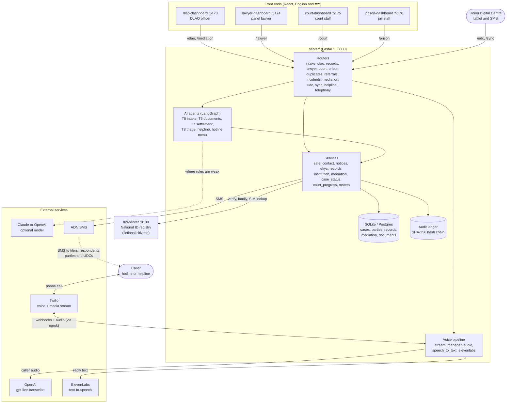
```mermaid
flowchart TB
  subgraph Front["Front ends (React, English and বাংলা)"]
    direction LR
    DLAO["dlao-dashboard :5173<br/>DLAO officer"]
    LAW["lawyer-dashboard :5174<br/>panel lawyer"]
    COURT["court-dashboard :5175<br/>court staff"]
    PRISON["prison-dashboard :5176<br/>jail staff"]
  end

  Caller(["Caller<br/>hotline or helpline"])
  UDC(["Union Digital Centre<br/>tablet and SMS"])

  subgraph Back["server/ (FastAPI, :8000)"]
    direction TB
    Routers["Routers<br/>intake, dlao, records, lawyer, court, prison,<br/>duplicates, referrals, incidents, mediation,<br/>udc, sync, helpline, telephony"]
    Agents["AI agents (LangGraph)<br/>T5 intake, T6 documents, T7 settlement,<br/>T8 triage, helpline, hotline menu"]
    Services["Services<br/>safe_contact, notices, ekyc, records,<br/>institution, mediation, case_status,<br/>court_progress, rosters"]
    Voice["Voice pipeline<br/>stream_manager, audio,<br/>speech_to_text, elevenlabs"]
    DB[("SQLite / Postgres<br/>cases, parties, records,<br/>mediation, documents")]
    Audit[("Audit ledger<br/>SHA-256 hash chain")]
    Routers --> Agents
    Routers --> Services
    Routers --> Voice
    Agents --> Services
    Services --> DB
    Services --> Audit
  end

  NID["nid-server :8100<br/>National ID registry<br/>(fictional citizens)"]

  subgraph Ext["External services"]
    direction LR
    Twilio["Twilio<br/>voice + media stream"]
    STT["OpenAI<br/>gpt-live-transcribe"]
    TTS["ElevenLabs<br/>text-to-speech"]
    LLM["Claude or OpenAI<br/>optional model"]
    ADN["ADN SMS"]
  end

  DLAO -->|"/dlao, /mediation"| Routers
  LAW -->|"/lawyer"| Routers
  COURT -->|"/court"| Routers
  PRISON -->|"/prison"| Routers
  UDC -->|"/udc, /sync"| Routers
  Caller <-->|"phone call"| Twilio
  Twilio <-->|"webhooks + audio (via ngrok)"| Voice
  Voice -->|"caller audio"| STT
  Voice -->|"reply text"| TTS
  Agents -.->|"where rules are weak"| LLM
  Services -->|"verify, family, SIM lookup"| NID
  Services -->|"SMS"| ADN
  ADN -.->|"SMS to filers, respondents,<br/>parties and UDCs"| Caller
```

How to read it:

- **Solid arrows** are calls the system always makes. **Dotted** ones are optional: with no
  model key the agents run on their rules alone.
- **Applications enter three ways**: the hotline (Twilio, the voice pipeline and the T5 intake
  agent), the courts' and jails' dashboards (e-KYC, then an application), and UDC tablets
  (the offline batch sync, `POST /sync/batch`).
- **Every outbound SMS goes through `safe_contact`** before it reaches ADN, so a blocked or
  restricted person is never texted by mistake.
- **The NID registry is called by the backend only.** No dashboard talks to it.

### Data flow between modules

Who writes what, and who reads it. This is what "reaches the others at once" means.

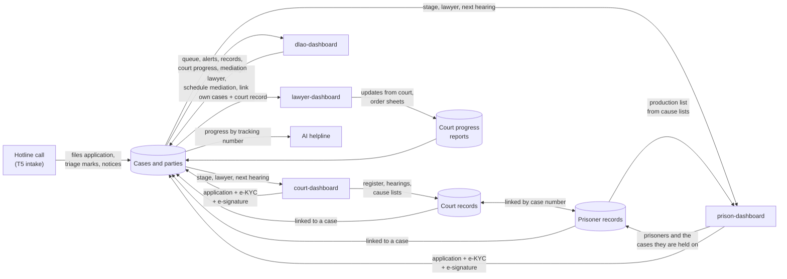
```mermaid
flowchart LR
  Hotline["Hotline call<br/>(T5 intake)"] -->|files application,<br/>triage marks, notices| Cases[("Cases and parties")]
  CourtDash["court-dashboard"] -->|register, hearings,<br/>cause lists| CourtRecs[("Court records")]
  CourtDash -->|application + e-KYC<br/>+ e-signature| Cases
  JailDash["prison-dashboard"] -->|prisoners and the<br/>cases they are held on| PrisonRecs[("Prisoner records")]
  JailDash -->|application + e-KYC<br/>+ e-signature| Cases
  OfficerDash["dlao-dashboard"] -->|confirm triage, assign lawyer,<br/>schedule mediation, link records| Cases
  LawyerDash["lawyer-dashboard"] -->|updates from court,<br/>order sheets| Progress[("Court progress<br/>reports")]

  CourtRecs <-->|linked by case number| PrisonRecs
  CourtRecs -->|linked to a case| Cases
  PrisonRecs -->|linked to a case| Cases
  Progress --> Cases

  Cases -->|queue, alerts, records,<br/>court progress, mediation| OfficerDash
  Cases -->|own cases + court record| LawyerDash
  Cases -->|stage, lawyer, next hearing| CourtDash
  Cases -->|stage, lawyer, next hearing| JailDash
  PrisonRecs -->|production list<br/>from cause lists| JailDash
  Cases -->|progress by tracking number| Helpline["AI helpline"]
```

## Module by module

### `server/`: the backend

Requests pass through three layers. Routers check who is asking and shape the response,
services hold the rules, and models are the tables. Agents are LangGraph graphs that run
without any model and consult one only where rules are weak.

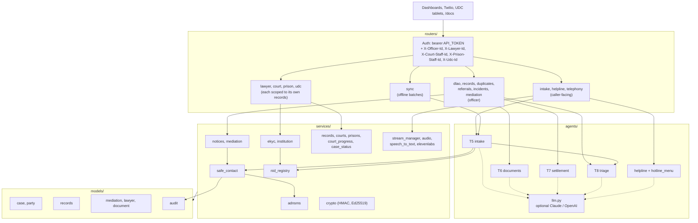
```mermaid
flowchart TB
  Client["Dashboards, Twilio, UDC tablets, /docs"] --> Auth

  subgraph API["routers/"]
    Auth["Auth: bearer API_TOKEN<br/>+ X-Officer-Id, X-Lawyer-Id,<br/>X-Court-Staff-Id, X-Prison-Staff-Id, X-Udc-Id"]
    Auth --> R1["intake, helpline, telephony<br/>(caller-facing)"]
    Auth --> R2["dlao, records, duplicates,<br/>referrals, incidents, mediation<br/>(officer)"]
    Auth --> R3["lawyer, court, prison, udc<br/>(each scoped to its own records)"]
    Auth --> R4["sync<br/>(offline batches)"]
  end

  subgraph AG["agents/"]
    T5["T5 intake"]
    T6["T6 documents"]
    T7["T7 settlement"]
    T8["T8 triage"]
    HL["helpline + hotline_menu"]
    LLMC["llm.py<br/>optional Claude / OpenAI"]
  end

  subgraph SV["services/"]
    SC["safe_contact"]
    NT["notices, mediation"]
    EK["ekyc, institution"]
    RC["records, courts, prisons,<br/>court_progress, case_status"]
    NR["nid_registry"]
    SMS["adnsms"]
    CR["crypto (HMAC, Ed25519)"]
    VP["stream_manager, audio,<br/>speech_to_text, elevenlabs"]
  end

  subgraph MD["models/"]
    M1["case, party"]
    M2["records"]
    M3["mediation, lawyer, document"]
    M4["audit"]
  end

  R1 --> T5
  R1 --> HL
  R1 --> VP
  R2 --> T6
  R2 --> T7
  R2 --> T8
  T5 --> T8
  R3 --> EK
  R3 --> RC
  R2 --> NT
  R4 --> T5
  T5 -.-> LLMC
  T6 -.-> LLMC
  T7 -.-> LLMC
  T8 -.-> LLMC
  HL -.-> LLMC
  T5 --> NR
  EK --> NR
  NT --> SC
  T5 --> SC
  SC --> SMS
  SV --> MD
  SC --> M4
```

| Layer | Contents |
| --- | --- |
| `routers/` | `intake`, `dlao`, `records` (the officer's view of court and jail records), `lawyer`, `court`, `prison`, `duplicates`, `referrals`, `incidents`, `mediation`, `udc`, `sync`, `helpline`, `telephony` |
| `agents/` | `t5_intake`, `t6_document`, `t7_settlement`, `t8_triage`, `helpline`, `hotline_menu`, plus `llm` (optional model access), `spoken` (reading callers' answers) and `state` |
| `services/` | `safe_contact`, `notices`, `mediation`, `adnsms`, `nid_registry`, `ekyc`, `institution`, `records`, `courts`, `prisons`, `panel`, `udc`, `case_status`, `court_progress`, `uploads`, `crypto`, and the voice services |
| `models/` | `case`, `party`, `document`, `lawyer`, `records`, `mediation`, `audit` |

#### Features by module

| | Feature | Where |
| --- | --- | --- |
| T1 | Alerts: overdue, lawyer inactivity, jurisdiction escalation, untriaged critical cases | `GET /dlao/alerts` |
| T2 | Referrals between district offices; ping-pong is escalated, not forwarded | `/referrals` |
| T3 | Group incidents linking cases from one event, with suggestions | `/incidents` |
| T4 | Fuzzy duplicate detection on every intake; merge blocked when NIDs differ | `/duplicates` |
| T5 | Conversational intake for the hotline, UDC and web | `/intake/conversations`, telephony |
| T6 | Document reading (OCR), summaries and a missing-documents checklist | `POST /intake/cases/{ref}/documents` |
| T7 | Settlement drafting under Section 21C, LASA 2000 | `POST /mediation/cases/{ref}/settlement-draft` |
| T8 | Triage: categorization, compliance, urgency, track | runs on every intake; `/dlao/cases/{ref}/triage/*` |
| T9 | Idempotent offline batch sync for the PWA | `POST /sync/batch` |
| T11 | Ed25519 e-signatures on approved settlements | `POST /mediation/signatures` |

The full endpoint list, each rule and every known limitation are in
[`server/README.md`](server/README.md).

#### The AI agents

Each agent is a LangGraph graph. Any model failure (network, rate limit, refusal, invalid
output) falls back to rules, and requests use structured outputs.


```mermaid
flowchart TB
  subgraph T5g["T5 intake: one turn of a conversation"]
    direction LR
    e1["extract<br/>read the caller's answer"] --> e2["check_danger<br/>999 / hostage / violence"]
    e2 --> e3["listen<br/>does it sound like a case?"]
    e3 -->|"nothing to act on"| eEnd(["end call"])
    e3 -->|"a case"| e4["resolve<br/>who, NID questions, relative,<br/>respondent, contact"]
    e4 --> e5["respond<br/>next question or file it"]
  end

  subgraph T8g["T8 triage: runs on every application"]
    direction LR
    t1["categorize<br/>keyword rules, model for<br/>unclear narratives"] --> t2["compliance<br/>risk factors and warning signs,<br/>each with the evidence found"]
    t2 --> t3["urgency<br/>rule-based priority"]
    t3 --> t4["track<br/>advice, mediation or sensitive"]
  end

  subgraph T6g["T6 documents"]
    direction LR
    d1["read<br/>OCR scans and PDFs"] --> d2["checklist<br/>missing documents"]
  end

  subgraph T7g["T7 settlement draft"]
    direction LR
    s1["screen<br/>refuse if violence on record"] -->|"ok"| s2["draft<br/>Section 21C, LASA 2000"]
    s1 -->|"stop"| sEnd(["stop"])
    s2 --> s3["review<br/>a draft that drops a term,<br/>party or statute is replaced<br/>by the template"]
  end

  subgraph HLg["Helpline"]
    direction LR
    h0["hotline_menu<br/>new case or status?"] --> h1["answer<br/>tracking number, notice number,<br/>office, documents, mediation"]
  end
```

| Agent | Rules only | With a model configured |
| --- | --- | --- |
| T5 intake | Keyword and pattern rules for problems, danger, names, phone numbers, dates | Reads every turn alongside the rules for free speech; can add a "this is a case" or "not a legal matter" verdict, never turn away a problem the rules know |
| T6 documents | Checklist by document kind | Reads scans and PDFs (image and PDF blocks) |
| T7 settlement | Template draft | Drafts, then review rejects a draft that drops a term, a party or the statutory reference |
| T8 triage | Keyword categorization, transparent priority rules | Categorizes narratives the rules cannot; may choose between advice and mediation but never lowers a sensitive mark; priority stays rule-based |
| Helpline | Fixed facts about the office, documents, fees and mediation | Answers other questions from the same facts |

#### The phone line

One call is one Twilio media stream. The backend listens, thinks and speaks on the same
socket, and the caller can talk over the line at any time.

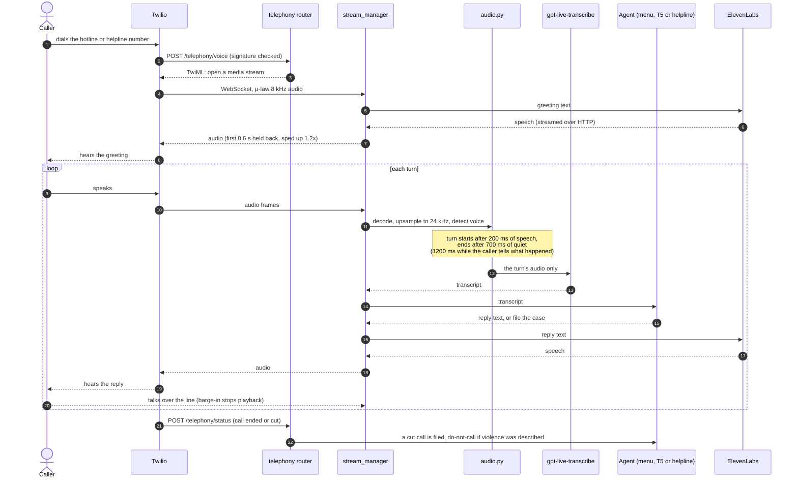
```mermaid
sequenceDiagram
  autonumber
  actor C as Caller
  participant TW as Twilio
  participant TP as telephony router
  participant SM as stream_manager
  participant AU as audio.py
  participant ST as gpt-live-transcribe
  participant AG as Agent (menu, T5 or helpline)
  participant EL as ElevenLabs

  C->>TW: dials the hotline or helpline number
  TW->>TP: POST /telephony/voice (signature checked)
  TP-->>TW: TwiML: open a media stream
  TW->>SM: WebSocket, μ-law 8 kHz audio
  SM->>EL: greeting text
  EL-->>SM: speech (streamed over HTTP)
  SM-->>TW: audio (first 0.6 s held back, sped up 1.2x)
  TW-->>C: hears the greeting
  loop each turn
    C->>TW: speaks
    TW->>SM: audio frames
    SM->>AU: decode, upsample to 24 kHz, detect voice
    Note over AU: turn starts after 200 ms of speech,<br/>ends after 700 ms of quiet<br/>(1200 ms while the caller tells what happened)
    AU->>ST: the turn's audio only
    ST-->>SM: transcript
    SM->>AG: transcript
    AG-->>SM: reply text, or file the case
    SM->>EL: reply text
    EL-->>SM: speech
    SM-->>TW: audio
    TW-->>C: hears the reply
    C-->>SM: talks over the line (barge-in stops playback)
  end
  TW->>TP: POST /telephony/status (call ended or cut)
  TP->>AG: a cut call is filed, do-not-call if violence was described
```

Failure paths: a lost speech-to-text session is reopened up to three times (after 0.3, 1 and
2 s); with no `OPENAI_API_KEY` the caller hears a short message (call 999 if in danger, apply
at a UDC) and the call ends; a voice that is definitely broken gets Twilio's own spoken
"cannot take applications by phone" message rather than silence.

#### Filing an application

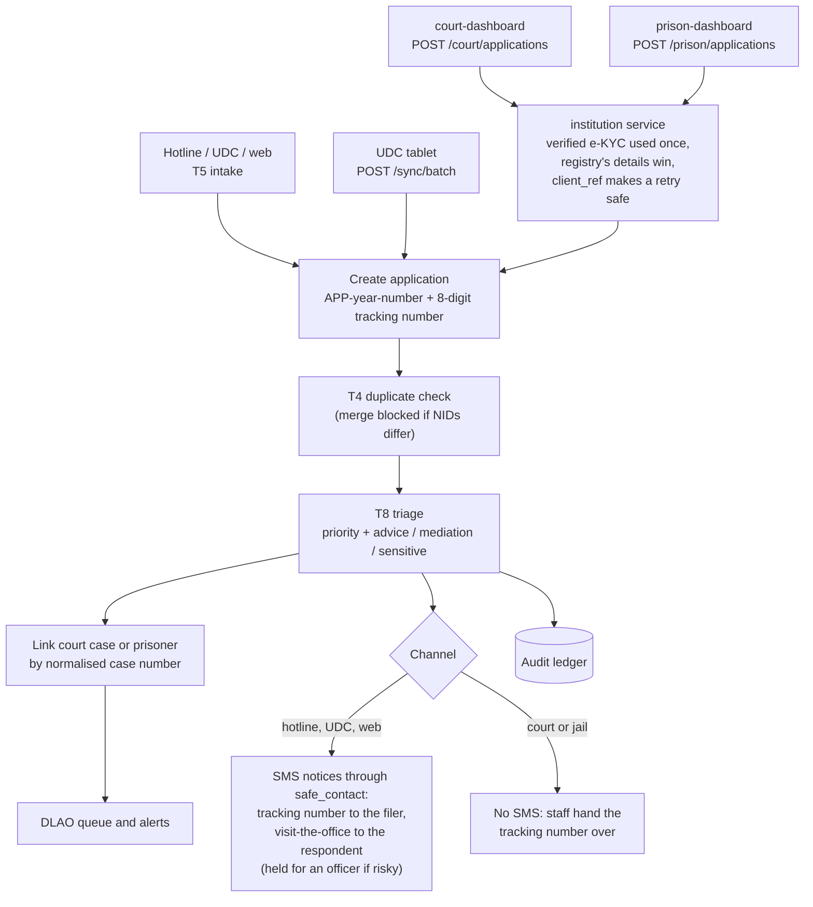
```mermaid
flowchart TB
  In1["Hotline / UDC / web<br/>T5 intake"] --> New
  In2["court-dashboard<br/>POST /court/applications"] --> Inst
  In3["prison-dashboard<br/>POST /prison/applications"] --> Inst
  In4["UDC tablet<br/>POST /sync/batch"] --> New

  Inst["institution service<br/>verified e-KYC used once,<br/>registry's details win,<br/>client_ref makes a retry safe"] --> New
  New["Create application<br/>APP-year-number + 8-digit tracking number"] --> Dup["T4 duplicate check<br/>(merge blocked if NIDs differ)"]
  Dup --> Tri["T8 triage<br/>priority + advice / mediation / sensitive"]
  Tri --> Link["Link court case or prisoner<br/>by normalised case number"]
  Link --> Q["DLAO queue and alerts"]
  Tri --> Notice{"Channel"}
  Notice -->|"hotline, UDC, web"| SMS["SMS notices through safe_contact:<br/>tracking number to the filer,<br/>visit-the-office to the respondent<br/>(held for an officer if risky)"]
  Notice -->|"court or jail"| Hand["No SMS: staff hand the<br/>tracking number over"]
  Tri --> Aud[("Audit ledger")]
```

#### Sending a message safely

Nothing reaches a phone except through `safe_contact`. Every decision, sent or blocked, is
audited without the message body.

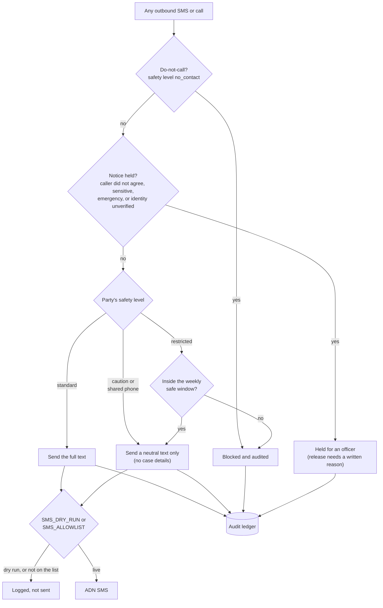
```mermaid
flowchart TB
  Msg["Any outbound SMS or call"] --> DNC{"Do-not-call?<br/>safety level no_contact"}
  DNC -->|"yes"| Block["Blocked and audited"]
  DNC -->|"no"| Hold{"Notice held?<br/>caller did not agree, sensitive,<br/>emergency, or identity unverified"}
  Hold -->|"yes"| Wait["Held for an officer<br/>(release needs a written reason)"]
  Hold -->|"no"| Lvl{"Party's safety level"}
  Lvl -->|"standard"| Send["Send the full text"]
  Lvl -->|"caution or<br/>shared phone"| Neutral["Send a neutral text only<br/>(no case details)"]
  Lvl -->|"restricted"| Win{"Inside the weekly<br/>safe window?"}
  Win -->|"no"| Block
  Win -->|"yes"| Neutral
  Send --> Gate{"SMS_DRY_RUN or<br/>SMS_ALLOWLIST"}
  Neutral --> Gate
  Gate -->|"dry run, or not on the list"| Log["Logged, not sent"]
  Gate -->|"live"| ADN["ADN SMS"]
  Send --> Aud[("Audit ledger")]
  Neutral --> Aud
  Block --> Aud
  Wait --> Aud
```

#### Mediation

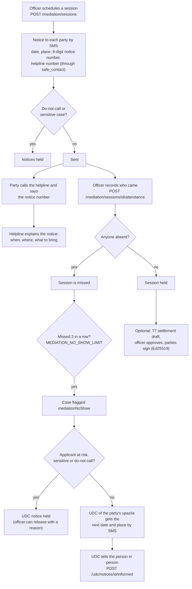
```mermaid
flowchart TB
  Sch["Officer schedules a session<br/>POST /mediation/sessions"] --> N["Notice to each party by SMS<br/>date, place, 8-digit notice number,<br/>helpline number (through safe_contact)"]
  N --> Held{"Do-not-call or<br/>sensitive case?"}
  Held -->|"yes"| HN["Notices held"]
  Held -->|"no"| Sent["Sent"]
  Sent --> Call["Party calls the helpline and says<br/>the notice number"]
  Call --> Exp["Helpline explains the notice:<br/>when, where, what to bring"]
  Sent --> Att["Officer records who came<br/>POST /mediation/sessions/id/attendance"]
  Att --> Miss{"Anyone absent?"}
  Miss -->|"yes"| Ms["Session is missed"]
  Ms --> Lim{"Missed 2 in a row?<br/>MEDIATION_NO_SHOW_LIMIT"}
  Lim -->|"yes"| Flag["Case flagged mediationNoShow"]
  Flag --> Risk{"Applicant at risk,<br/>sensitive or do-not-call?"}
  Risk -->|"yes"| UH["UDC notice held<br/>(officer can release with a reason)"]
  Risk -->|"no"| UN["UDC of the party's upazila gets the<br/>next date and place by SMS"]
  UN --> UI["UDC tells the person in person<br/>POST /udc/notices/id/informed"]
  Miss -->|"no"| Ok["Session held"]
  Ok --> Draft["Optional: T7 settlement draft,<br/>officer approves, parties sign (Ed25519)"]
```

### `nid-server/`: the National ID registry

A read-only stand-in for the Election Commission's verification service, holding 40
fictional citizens. The backend uses it to verify callers, find relatives and find a
respondent's SIMs.

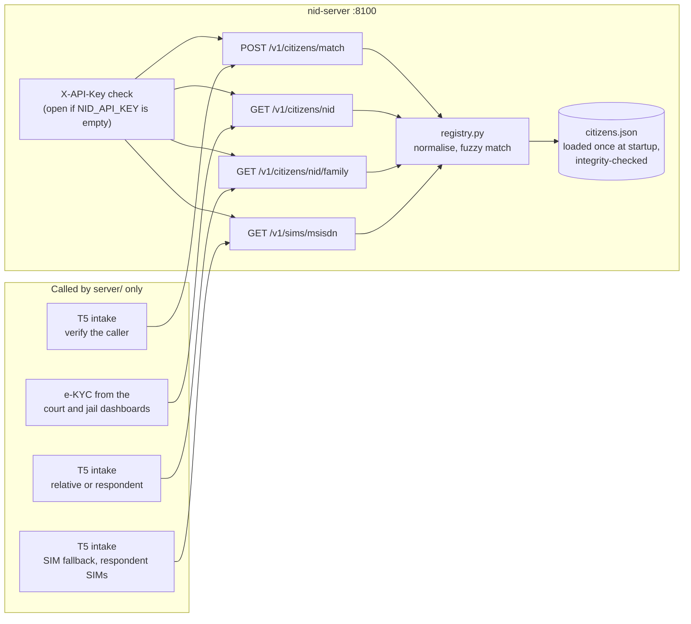
```mermaid
flowchart LR
  subgraph Callers["Called by server/ only"]
    A["T5 intake<br/>verify the caller"]
    B["T5 intake<br/>relative or respondent"]
    C["T5 intake<br/>SIM fallback, respondent SIMs"]
    D["e-KYC from the<br/>court and jail dashboards"]
  end

  subgraph NIDS["nid-server :8100"]
    K["X-API-Key check<br/>(open if NID_API_KEY is empty)"]
    K --> E1["POST /v1/citizens/match"]
    K --> E2["GET /v1/citizens/nid"]
    K --> E3["GET /v1/citizens/nid/family"]
    K --> E4["GET /v1/sims/msisdn"]
    E1 --> REG["registry.py<br/>normalise, fuzzy match"]
    E2 --> REG
    E3 --> REG
    E4 --> REG
    REG --> DATA[("citizens.json<br/>loaded once at startup,<br/>integrity-checked")]
  end

  A --> E1
  B --> E3
  C --> E4
  D --> E2
```

Matching rules in short: a request needs a name plus at least two other details; every given
field must agree; names are compared fuzzily (rapidfuzz `token_sort_ratio`, threshold 85,
honorifics removed, English or Bangla spelling); date of birth must be exact; districts
ignore old spellings (Chittagong, Comilla, Bogra and so on). `unique` is true only when
exactly one citizen matched. The service refuses to start if the data file breaks its
integrity rules. See [`nid-server/README.md`](nid-server/README.md).

The registry is also used for the e-KYC check that courts and jails run before a
signature is accepted:

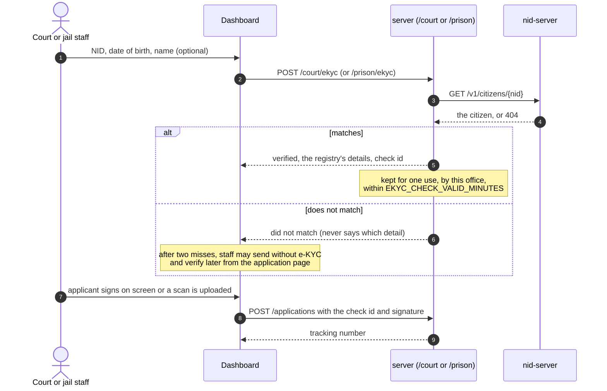
```mermaid
sequenceDiagram
  autonumber
  actor S as Court or jail staff
  participant D as Dashboard
  participant API as server (/court or /prison)
  participant N as nid-server

  S->>D: NID, date of birth, name (optional)
  D->>API: POST /court/ekyc (or /prison/ekyc)
  API->>N: GET /v1/citizens/{nid}
  N-->>API: the citizen, or 404
  alt matches
    API-->>D: verified, the registry's details, check id
    Note over API: kept for one use, by this office,<br/>within EKYC_CHECK_VALID_MINUTES
  else does not match
    API-->>D: did not match (never says which detail)
    Note over D: after two misses, staff may send without e-KYC<br/>and verify later from the application page
  end
  S->>D: applicant signs on screen or a scan is uploaded
  D->>API: POST /applications with the check id and signature
  API-->>D: tracking number
```

### The four dashboards

All four are the same kind of app: React 19, TypeScript, Vite, Tailwind CSS v4, shadcn/ui,
hash URLs (so `dist/` works on any static host), and a whole UI in English and বাংলা. They
share one shape:

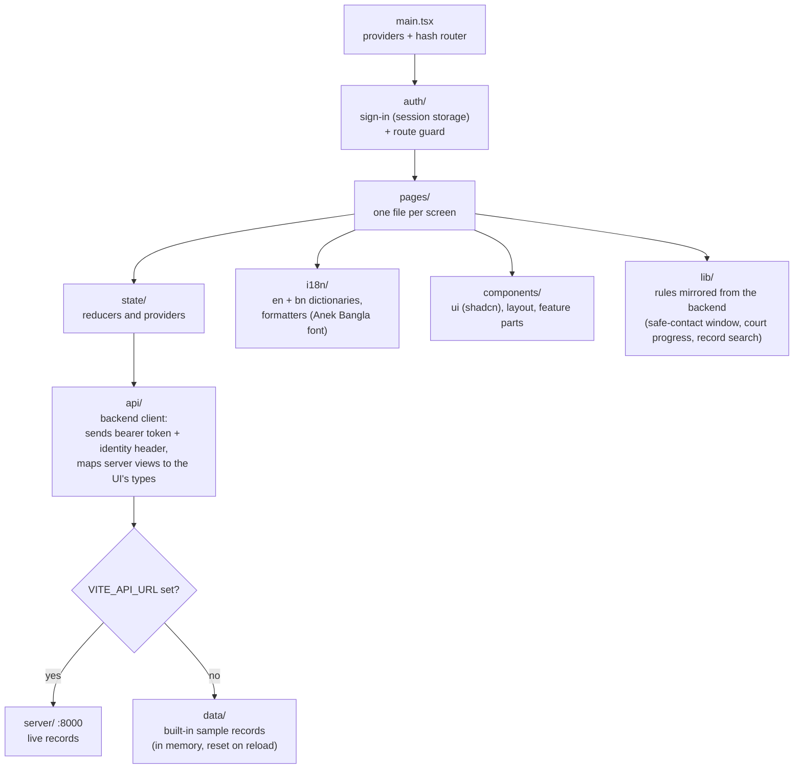
```mermaid
flowchart TB
  Main["main.tsx<br/>providers + hash router"] --> Guard["auth/<br/>sign-in (session storage)<br/>+ route guard"]
  Guard --> Pages["pages/<br/>one file per screen"]
  Pages --> State["state/<br/>reducers and providers"]
  Pages --> I18N["i18n/<br/>en + bn dictionaries,<br/>formatters (Anek Bangla font)"]
  Pages --> UI["components/<br/>ui (shadcn), layout, feature parts"]
  State --> API["api/<br/>backend client:<br/>sends bearer token + identity header,<br/>maps server views to the UI's types"]
  API --> Env{"VITE_API_URL set?"}
  Env -->|"yes"| Server["server/ :8000<br/>live records"]
  Env -->|"no"| Sample["data/<br/>built-in sample records<br/>(in memory, reset on reload)"]
  Pages --> Lib["lib/<br/>rules mirrored from the backend<br/>(safe-contact window, court progress, record search)"]
```

Without `VITE_API_URL` each dashboard runs on built-in sample data, so it can be tried with
no backend. With it, the backend's `CORS_ORIGINS` must include the dashboard's port.

#### `dlao-dashboard/` (port 5173): the officer

Sign in with any officer ID and a password of 4+ characters (a demo account is one click).
Opening a case fetches its history, call notes, the lawyer's reports and transfers; the
**Court and jail records** and **Mediation** tabs are fetched only when opened, because the
server audits every look.

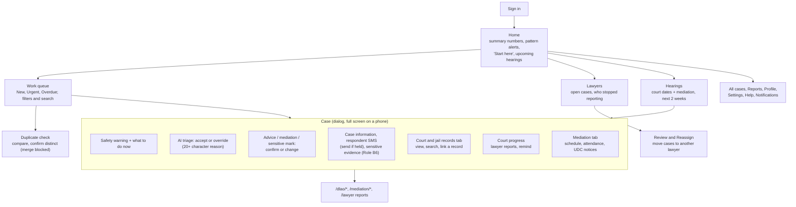
```mermaid
flowchart TB
  SI["Sign in"] --> Home["Home<br/>summary numbers, pattern alerts,<br/>'Start here', upcoming hearings"]
  Home --> Queue["Work queue<br/>New, Urgent, Overdue; filters and search"]
  Home --> Lawyers["Lawyers<br/>open cases, who stopped reporting"]
  Home --> Hearings["Hearings<br/>court dates + mediation, next 2 weeks"]
  Queue --> Case
  Lawyers --> Reassign["Review and Reassign<br/>move cases to another lawyer"]
  Hearings --> Case
  Home --> Others["All cases, Reports, Profile,<br/>Settings, Help, Notifications"]

  subgraph Case["Case (dialog, full screen on a phone)"]
    direction TB
    C1["Safety warning + what to do now"]
    C2["AI triage: accept or override<br/>(20+ character reason)"]
    C3["Advice / mediation / sensitive mark:<br/>confirm or change"]
    C4["Case information, respondent SMS<br/>(send if held), sensitive evidence (Role B6)"]
    C5["Court and jail records tab<br/>view, search, link a record"]
    C6["Court progress<br/>lawyer reports, remind"]
    C7["Mediation tab<br/>schedule, attendance, UDC notices"]
  end
  Queue --> Dup["Duplicate check<br/>compare, confirm distinct (merge blocked)"]
  Case --> API["/dlao/*, /mediation/*, /lawyer reports"]
```

Saved on the server: accepting or overriding triage, the advice / mediation / sensitive mark,
sending a held SMS, assigning or moving a lawyer, reminding a lawyer, escalating to the Chief
Legal Aid Officer, acknowledging sensitive evidence, linking a court case or prisoner,
scheduling mediation, recording attendance, and sending a held UDC notice. Safe-call
booking, duplicate decisions, marking a late task done and hearing reminders stay on screen
only for now.

#### `lawyer-dashboard/` (port 5174): the panel lawyer

A lawyer sees only the cases an officer assigned to them. The server sends no phone number
for an applicant nobody may call, and shows the safe time for a watched phone.

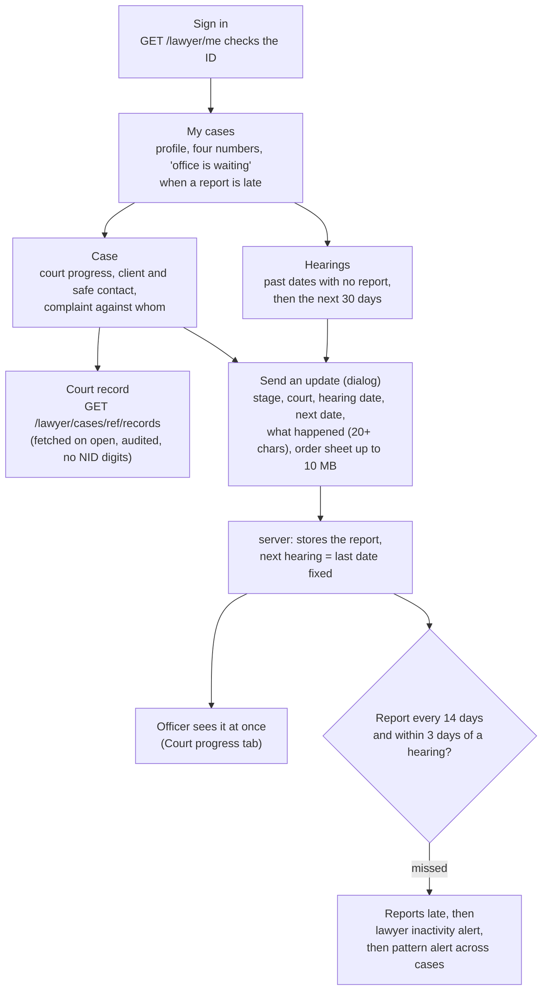
```mermaid
flowchart TB
  SI["Sign in<br/>GET /lawyer/me checks the ID"] --> My["My cases<br/>profile, four numbers, 'office is waiting'<br/>when a report is late"]
  My --> Case["Case<br/>court progress, client and safe contact,<br/>complaint against whom"]
  My --> Hear["Hearings<br/>past dates with no report,<br/>then the next 30 days"]
  Case --> Rec["Court record<br/>GET /lawyer/cases/ref/records<br/>(fetched on open, audited, no NID digits)"]
  Case --> Upd
  Hear --> Upd["Send an update (dialog)<br/>stage, court, hearing date, next date,<br/>what happened (20+ chars), order sheet up to 10 MB"]
  Upd --> Srv["server: stores the report,<br/>next hearing = last date fixed"]
  Srv --> Off["Officer sees it at once<br/>(Court progress tab)"]
  Srv --> Rule{"Report every 14 days<br/>and within 3 days of a hearing?"}
  Rule -->|"missed"| Late["Reports late, then<br/>lawyer inactivity alert,<br/>then pattern alert across cases"]
```

#### `court-dashboard/` (port 5175): court staff

A court sees only its own register, cause lists and applications. Anything else is "not
found", so another court's record IDs are never confirmed.

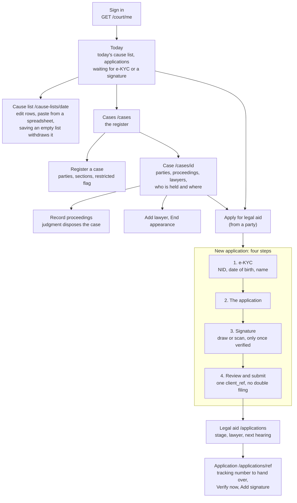
```mermaid
flowchart TB
  SI["Sign in<br/>GET /court/me"] --> Today["Today<br/>today's cause list, applications<br/>waiting for e-KYC or a signature"]
  Today --> CL["Cause list /cause-lists/date<br/>edit rows, paste from a spreadsheet,<br/>saving an empty list withdraws it"]
  Today --> Cases["Cases /cases<br/>the register"]
  Cases --> Reg["Register a case<br/>parties, sections, restricted flag"]
  Cases --> Case["Case /cases/id<br/>parties, proceedings, lawyers,<br/>who is held and where"]
  Case --> Proc["Record proceedings<br/>judgment disposes the case"]
  Case --> Lw["Add lawyer, End appearance"]
  Case --> Apply["Apply for legal aid<br/>(from a party)"]
  Today --> Apply
  subgraph Wiz["New application: four steps"]
    direction LR
    W1["1. e-KYC<br/>NID, date of birth, name"] --> W2["2. The application"] --> W3["3. Signature<br/>draw or scan, only once verified"] --> W4["4. Review and submit<br/>one client_ref, no double filing"]
  end
  Apply --> Wiz
  W4 --> AppList["Legal aid /applications<br/>stage, lawyer, next hearing"]
  AppList --> App["Application /applications/ref<br/>tracking number to hand over,<br/>Verify now, Add signature"]
```

#### `prison-dashboard/` (port 5176): jail staff

A jail sees only its own prisoners and applications, and of each court case only what it needs
to produce the prisoner. It never sees the case file, proceedings, other parties, or what the
officer does inside a case beyond stage, lawyer and next hearing.

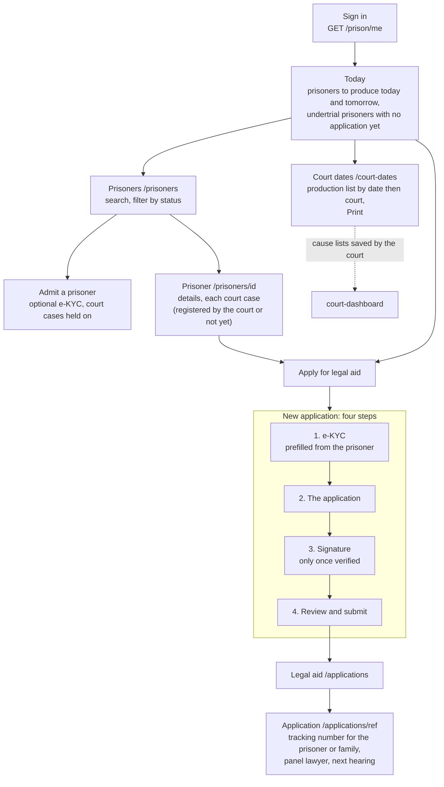
```mermaid
flowchart TB
  SI["Sign in<br/>GET /prison/me"] --> Today["Today<br/>prisoners to produce today and tomorrow,<br/>undertrial prisoners with no application yet"]
  Today --> CD["Court dates /court-dates<br/>production list by date then court,<br/>Print"]
  Today --> Pr["Prisoners /prisoners<br/>search, filter by status"]
  Pr --> Adm["Admit a prisoner<br/>optional e-KYC, court cases held on"]
  Pr --> P["Prisoner /prisoners/id<br/>details, each court case<br/>(registered by the court or not yet)"]
  P --> Apply["Apply for legal aid"]
  Today --> Apply
  subgraph Wiz["New application: four steps"]
    direction LR
    W1["1. e-KYC<br/>prefilled from the prisoner"] --> W2["2. The application"] --> W3["3. Signature<br/>only once verified"] --> W4["4. Review and submit"]
  end
  Apply --> Wiz
  W4 --> Apps["Legal aid /applications"]
  Apps --> App["Application /applications/ref<br/>tracking number for the prisoner or family,<br/>panel lawyer, next hearing"]
  CD -.->|"cause lists saved by the court"| CourtSide["court-dashboard"]
```

## How a case moves

1. **Someone calls the hotline.** The AI asks whether they want to file a new case or hear the
   progress of one they filed. For progress it asks for the tracking number and reads out where
   the case stands. For a new case it listens: it asks nothing until the caller has said what
   happened, and a caller who starts telling it straight away, or who is in danger, is heard at
   once. Danger in those first words gets the 999 line at once. Once
   it sounds like a case, the AI asks only what it still needs: who the application is for,
   the caller's name and three NID security questions (father's name, permanent district,
   date of birth). If the caller cannot answer, it searches the NID registry itself, through
   the SIM they are calling from. It notes everything the caller says.
2. **Danger changes everything.** If the caller seems to be held hostage, or the call is cut
   while they describe violence, the case is marked **Do not call this number**. Calls and SMS
   to them are blocked, and what they said before the line went dead is kept.
3. **The AI marks, the officer decides.** Every case is marked *can be resolved through
   advice*, *through mediation*, or *sensitive*, with a priority and its reasons. Officers
   confirm or change each mark on the dashboard.
4. **Both sides hear by SMS** (ADN SMS). The person who filed gets a tracking number. The
   person the case is against, found through the SIMs registered under their NID, is asked to
   visit the DLAO office. That notice waits for an officer whenever sending it could put the
   applicant at risk.
5. **Courts and jails apply directly.** Court staff and the jail's legal aid desk submit an
   application for someone before them on their own dashboards, so the office never retypes
   it. They first check who the person is against the NID registry (e-KYC: NID number, date of
   birth and name); only then can they add the person's e-signature, drawn on screen or
   scanned. The application arrives in the officer's queue like any other, marked with the
   court or jail that sent it, and someone in custody is at least high priority. The court or
   jail follows its progress (stage, lawyer, next hearing) and hands the tracking number to
   the applicant.
6. **One record of the person's court cases.** Courts keep their register there (case
   numbers, parties, what happened at each hearing, the lawyers who appeared, the daily cause
   list), and jails keep their prisoners, linked to the cases they are held on. An officer
   sees the records linked to a case, and the case's panel lawyer sees the same for their
   own cases: the history, the previous lawyers, the next listing and where the client is
   held, without asking anyone for it again. Each role sees only what its work needs, every
   look is recorded, and records a court marks restricted (a juvenile's case, a sealed record)
   never appear as anyone's previous record.
7. **The helpline number in each SMS reaches an AI.** It tells a caller their case's progress
   from the tracking number (and the next court date), and answers questions about notices, the
   office, documents and mediation.
8. **Mediation, when the officer decides to try it.** Both parties get an SMS notice with the
   date, the place, a notice number and the helpline number. A party who does not understand
   it calls the helpline, says the notice number and hears what the notice means, and can ask
   when, where and what to bring. The officer records who came. Someone who misses two
   sessions in a row is looked for through their Union Digital Centre, which is sent the next
   date to tell them in person; for an applicant whose safety is at risk, that waits for an
   officer.
9. **A panel lawyer takes the case to court.** The officer assigns one of the district's panel
   lawyers, who sees the case on their own dashboard and reports after every hearing: what
   happened, the next date, and the order sheet. A report is due every two weeks and within
   three days of each hearing. The officer sees each report at once; a lawyer who stops
   reporting is flagged, and one who stops across several cases raises a pattern alert, from
   which the officer can move their cases to another lawyer.

## Case lifecycle diagrams

### A case from call to closure

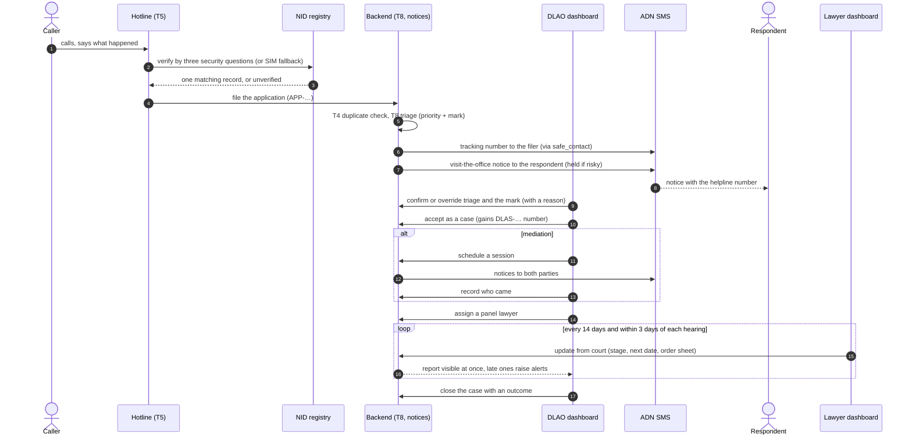
```mermaid
sequenceDiagram
  autonumber
  actor Caller
  participant Line as Hotline (T5)
  participant NID as NID registry
  participant Srv as Backend (T8, notices)
  participant DL as DLAO dashboard
  participant SMS as ADN SMS
  actor Resp as Respondent
  participant Law as Lawyer dashboard

  Caller->>Line: calls, says what happened
  Line->>NID: verify by three security questions (or SIM fallback)
  NID-->>Line: one matching record, or unverified
  Line->>Srv: file the application (APP-…)
  Srv->>Srv: T4 duplicate check, T8 triage (priority + mark)
  Srv->>SMS: tracking number to the filer (via safe_contact)
  Srv->>SMS: visit-the-office notice to the respondent (held if risky)
  SMS-->>Resp: notice with the helpline number
  DL->>Srv: confirm or override triage and the mark (with a reason)
  DL->>Srv: accept as a case (gains DLAS-… number)
  alt mediation
    DL->>Srv: schedule a session
    Srv->>SMS: notices to both parties
    DL->>Srv: record who came
  end
  DL->>Srv: assign a panel lawyer
  loop every 14 days and within 3 days of each hearing
    Law->>Srv: update from court (stage, next date, order sheet)
    Srv-->>DL: report visible at once, late ones raise alerts
  end
  DL->>Srv: close the case with an outcome
```

### Case status and the officer's decisions

A case's `status` and the separate marks an officer confirms. The AI only marks; a human
decides.

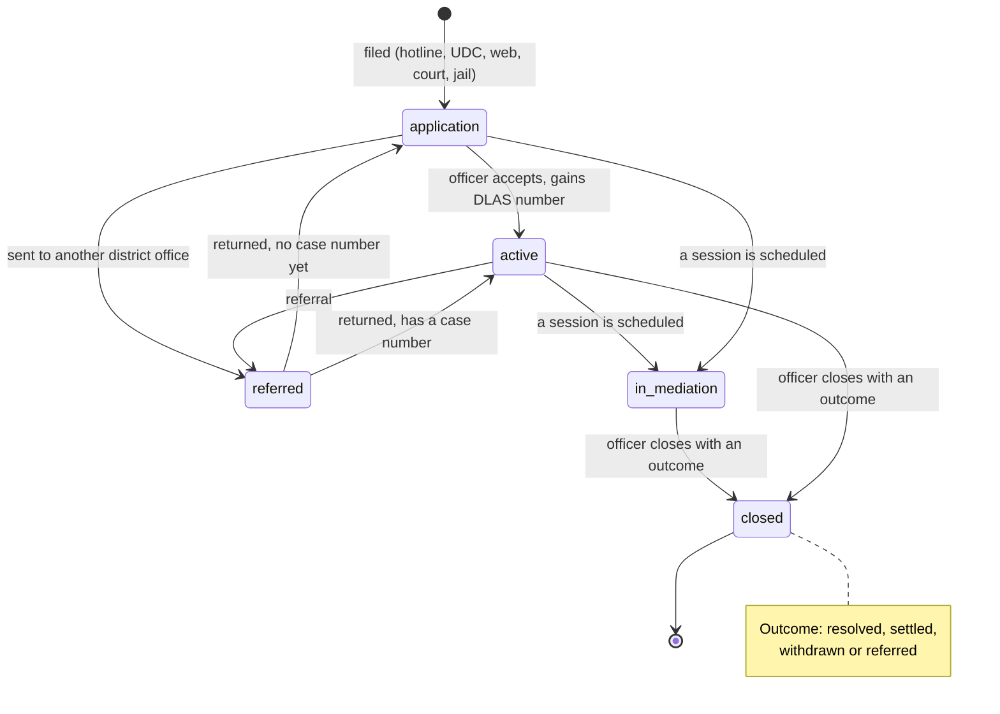
```mermaid
stateDiagram-v2
  [*] --> application: filed (hotline, UDC, web, court, jail)
  application --> active: officer accepts, gains DLAS number
  application --> referred: sent to another district office
  active --> referred: referral
  referred --> application: returned, no case number yet
  referred --> active: returned, has a case number
  active --> in_mediation: a session is scheduled
  application --> in_mediation: a session is scheduled
  in_mediation --> closed: officer closes with an outcome
  active --> closed: officer closes with an outcome
  closed --> [*]
  note right of closed
    Outcome: resolved, settled,
    withdrawn or referred
  end note
```

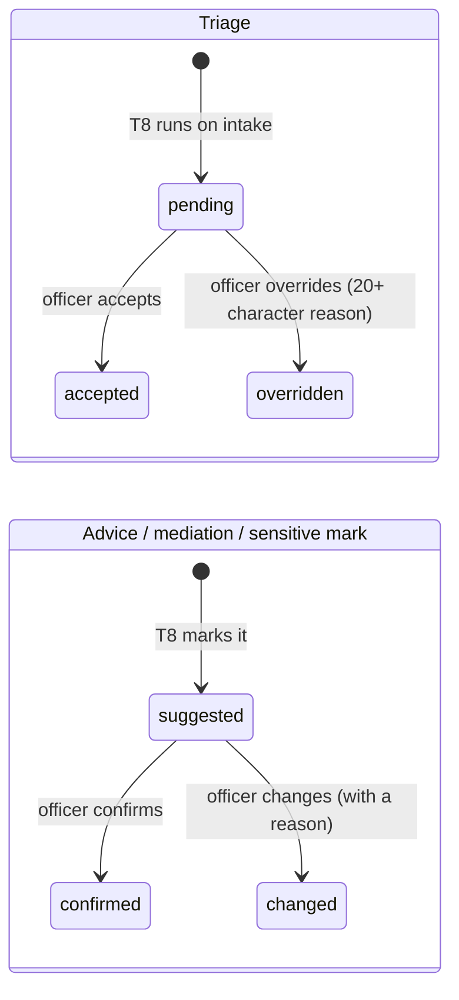
```mermaid
stateDiagram-v2
  direction LR
  state "Triage" as tri {
    [*] --> pending: T8 runs on intake
    pending --> accepted: officer accepts
    pending --> overridden: officer overrides (20+ character reason)
  }
  state "Advice / mediation / sensitive mark" as trk {
    [*] --> suggested: T8 marks it
    suggested --> confirmed: officer confirms
    suggested --> changed: officer changes (with a reason)
  }
```

### A court or jail application, end to end

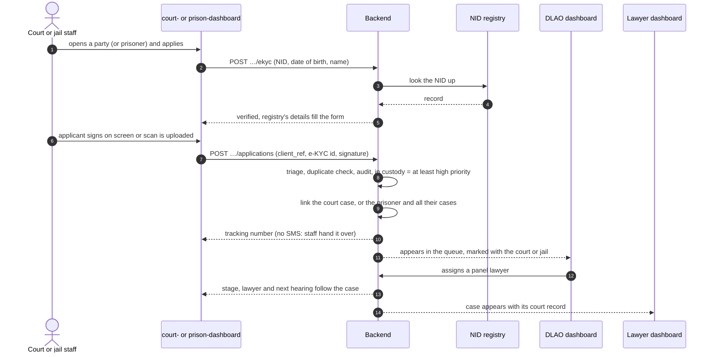
```mermaid
sequenceDiagram
  autonumber
  actor Staff as Court or jail staff
  participant Dash as court- or prison-dashboard
  participant Srv as Backend
  participant NID as NID registry
  participant DL as DLAO dashboard
  participant Law as Lawyer dashboard

  Staff->>Dash: opens a party (or prisoner) and applies
  Dash->>Srv: POST …/ekyc (NID, date of birth, name)
  Srv->>NID: look the NID up
  NID-->>Srv: record
  Srv-->>Dash: verified, registry's details fill the form
  Staff->>Dash: applicant signs on screen or scan is uploaded
  Dash->>Srv: POST …/applications (client_ref, e-KYC id, signature)
  Srv->>Srv: triage, duplicate check, audit, in custody = at least high priority
  Srv->>Srv: link the court case, or the prisoner and all their cases
  Srv-->>Dash: tracking number (no SMS: staff hand it over)
  Srv-->>DL: appears in the queue, marked with the court or jail
  DL->>Srv: assigns a panel lawyer
  Srv-->>Dash: stage, lawyer and next hearing follow the case
  Srv-->>Law: case appears with its court record
```

### Who sees which record

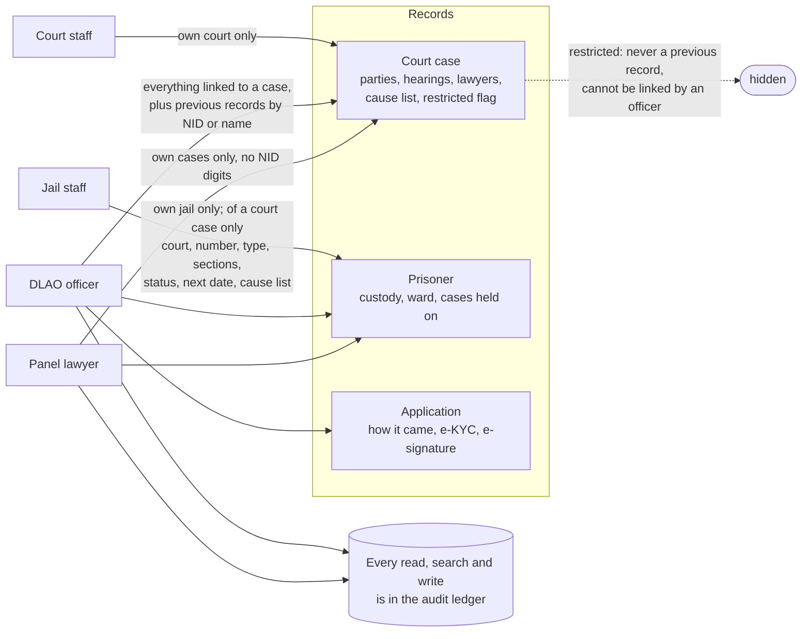
```mermaid
flowchart LR
  subgraph Records["Records"]
    CC["Court case<br/>parties, hearings, lawyers,<br/>cause list, restricted flag"]
    PR["Prisoner<br/>custody, ward, cases held on"]
    APP["Application<br/>how it came, e-KYC, e-signature"]
  end
  Court["Court staff"] -->|"own court only"| CC
  Jail["Jail staff"] -->|"own jail only; of a court case only<br/>court, number, type, sections,<br/>status, next date, cause list"| PR
  Officer["DLAO officer"] -->|"everything linked to a case,<br/>plus previous records by NID or name"| CC
  Officer --> PR
  Officer --> APP
  Lawyer["Panel lawyer"] -->|"own cases only, no NID digits"| CC
  Lawyer --> PR
  CC -.->|"restricted: never a previous record,<br/>cannot be linked by an officer"| X(["hidden"])
  Audit[("Every read, search and write<br/>is in the audit ledger")]
  Officer --> Audit
  Lawyer --> Audit
```

### Data model

The main tables and how they connect (`server/app/models/`). Only the columns that explain
the relationships are shown.

```mermaid
erDiagram
  cases ||--o{ case_parties : has
  parties ||--o{ case_parties : "plays a role in"
  parties ||--o{ duplicate_reviews : "compared in"
  incidents ||--o{ cases : groups
  cases ||--o{ referrals : "moves between offices"
  cases ||--o{ documents : holds
  documents ||--o{ checklist_items : "missing-documents list"
  documents ||--o{ signatures : "signed (Ed25519)"
  parties ||--o{ signatures : signs
  cases ||--o{ lawyer_updates : "reports from court"
  cases ||--o{ mediation_sessions : schedules
  mediation_sessions ||--o{ mediation_attendance : records
  mediation_sessions ||--o{ mediation_notices : "SMS to each party"
  mediation_sessions ||--o{ udc_notices : "asks a UDC to reach"
  cases ||--o| institution_applications : "submitted by court or jail"
  ekyc_checks ||--o| institution_applications : "identifies the applicant"
  cases ||--o{ case_record_links : "linked to"
  court_cases ||--o{ case_record_links : "linked to"
  prisoners ||--o{ case_record_links : "linked to"
  court_cases ||--o{ court_case_parties : has
  court_cases ||--o{ court_proceedings : "what happened at each hearing"
  court_cases ||--o{ court_case_lawyers : "lawyers now and before"
  court_cases ||--o{ cause_list_entries : "daily cause list"
  prisoners ||--o{ prisoner_cases : "held on"

  cases {
    string ref "APP-year-n, then DLAS-year-n"
    string status "application, active, referred, in_mediation, closed"
    string priority "critical, high, medium, low"
    string track "advice, mediation, sensitive"
    string channel "hotline, udc, online, court, prison, ..."
  }
  parties {
    string nid_hash "keyed HMAC, never the NID"
    string nid_last4
    string safety_level "standard, restricted, caution, no_contact"
  }
  audit_entries {
    string hash "SHA-256 chain, append-only"
  }
  sync_receipts {
    string idempotency_key "T9 offline batches"
  }
```

`audit_entries` (a hash chain the ORM refuses to update or delete) and `sync_receipts`
(idempotent offline batches) stand alone: they refer to cases by reference, not by key.

## Run everything locally

```bash
./start.sh
```

This starts the NID registry, the backend with its SQLite database (`server/dlas.db`, created
at startup, with the demo court and jail records added), the four dashboards and an ngrok
tunnel that puts the phone lines and the dashboards on the internet, then prints their
addresses, the Twilio webhooks and whether the AI, speech-to-text and the voice are working
(the voice is checked with ElevenLabs at startup). The first run installs the dependencies and creates
`server/.env`. Each service's output is shown with its name and kept in `.logs/`. Ctrl-C
stops everything, and so does any one service stopping.

| Option | What it does |
| --- | --- |
| `--no-ngrok` | No tunnel: only this computer can use the dashboards, and everything but real phone calls works |
| `--no-dashboard` | Backend only (no dashboards) |
| `--reset-db` | Starts with an empty database (after a schema change); the old file is kept as a backup |
| `--no-seed` | Leaves out the demo court cases, cause lists and prisoners |
| `--install` | Reinstalls every dependency first |

The tunnel uses `PUBLIC_BASE_URL` from `server/.env` as its domain, so the Twilio numbers
keep working between runs. Without one, ngrok picks a new URL each time; the backend is
given that URL, and the script warns you to repoint the numbers. The script needs `uv` (or
Python 3.12), Node.js and a signed-in `ngrok`.

### The dashboards from anywhere

Through the tunnel, anyone with the address can open the dashboards, on the backend's own
public URL:

| Dashboard | From anywhere | On this computer |
| --- | --- | --- |
| DLAO | `<public URL>/dlao-dashboard/` | <http://localhost:5173> |
| Panel lawyers | `<public URL>/lawyer-dashboard/` | <http://localhost:5174> |
| Courts | `<public URL>/court-dashboard/` | <http://localhost:5175> |
| Jails | `<public URL>/prison-dashboard/` | <http://localhost:5176> |

The public URL (for example `https://reach-parched-pastor.ngrok-free.dev`) is the one
`start.sh` prints. ngrok sends each dashboard's path to that dashboard and everything else to
the backend. The dashboards there are production builds (served from ports 4173–4176) that
call the backend at the public URL. They are rebuilt whenever their code changes: reload the
page to see a change. On this computer the dev servers keep hot reload and call the backend at
<http://localhost:8000>. A dev server's page is around 185 requests, more than ngrok's free
plan lets through at once.

- A visitor's first page is ngrok's free-plan warning ("You are about to visit…"). **Visit
  Site** opens the dashboard; the dashboards' own calls to the backend skip it.
- The free plan allows 20,000 requests and 1 GB a month. Opening a dashboard takes about 7
  requests and 0.5 MB, and each screen a few more requests to the backend.
- Anyone with the address can sign in with the demo accounts and see the cases. If the
  backend has an `API_TOKEN`, the dashboards carry it to every visitor, and `start.sh` warns
  you.

Or start each part by hand:

```bash
# 1. NID registry
cd nid-server && uv venv --python 3.12 .venv && uv pip install -r requirements-dev.txt --python .venv/bin/python
.venv/bin/uvicorn app.main:app --port 8100 &

# 2. Backend (SMS stays a dry run unless you configure ADN and SMS_DRY_RUN=false)
cd ../server && uv venv --python 3.12 .venv && uv pip install -r requirements-dev.txt --python .venv/bin/python
cp .env.example .env    # NID_SERVER_URL=http://localhost:8100 is already set
.venv/bin/python -m scripts.seed_records    # demo court cases, cause lists and prisoners
.venv/bin/uvicorn app.main:app --port 8000 &

# 3. Dashboard, showing the backend's cases
cd ../dlao-dashboard && npm install
echo "VITE_API_URL=http://localhost:8000" > .env.local
npm run dev &

# 4. Panel lawyers' dashboard, on the same backend (port 5174)
cd ../lawyer-dashboard && npm install
echo "VITE_API_URL=http://localhost:8000" > .env.local
npm run dev &

# 5. Courts' and jails' dashboards, on the same backend (ports 5175 and 5176)
for app in court-dashboard prison-dashboard; do
  (cd ../$app && npm install && echo "VITE_API_URL=http://localhost:8000" > .env.local && npm run dev &)
done
```

To follow an application from a jail: on the jail dashboard, sign in as Nasima Khatun
(`JS-08`), open Jalal Uddin (`RCJ-2026-0412`) and apply for legal aid. Verify him by e-KYC
(NID `2854106397`, born 5 June 1990), let him sign on screen and submit. The case is in the DLAO
dashboard's queue at high priority, marked *In custody*; its **Court and jail records** tab shows
his charge, the lawyer who withdrew, his next listing and his previous case. Assign it to a
panel lawyer, and the jail sees the lawyer's name at once. Court staff do the same from the
court dashboard (`CS-11`), for anyone on their register.

To follow a case from the officer to the lawyer and back: assign a panel lawyer on the DLAO
dashboard (for example Adv. Nasrin Jahan, `LAW-12`), sign in as that lawyer on the lawyers'
dashboard, send an update from court, then open the case's **Court progress** tab on the DLAO
dashboard.

Try a call without a phone line at <http://localhost:8000/docs>. Start with
`POST /intake/conversations`, then send each answer to `/intake/conversations/{id}/turns`.
[`nid-server/README.md`](nid-server/README.md) lists people you can call as, such as Rafiqul
Islam applying for his mother.

To hear the voice path (speech-to-text, the agents and the spoken replies), set
`OPENAI_API_KEY` and the ElevenLabs keys in `server/.env` (and `LLM_PROVIDER=openai` for
the agents to use `gpt-6-luna`), then call a line from recorded answers with
`scripts/simulate_call.py`. For real calls through Twilio, see *Telephony* in
[`server/README.md`](server/README.md).

> The registry's people are fictional, but their phone numbers may belong to real
> subscribers. Keep `SMS_DRY_RUN=true`, or list only your own numbers in `SMS_ALLOWLIST`,
> while it is connected.

## Deploy on the VPS

`deploy/deploy.sh` runs everything on the VPS. The backend and the NID registry run under
pm2 on localhost ports. The dashboards and the legal aid app are static builds that nginx
serves, each on its own `appbaksho.com` subdomain over HTTPS. For example, the DLAO
dashboard is at `https://dlao.appbaksho.com` and the backend at
`https://dlas-api.appbaksho.com`. [`deploy/README.md`](deploy/README.md) covers the hosts
and ports, the DNS records, redeploying, the settings and the Twilio webhooks.

## Testing and quality checks

Run each module's checks from its own folder. Every command below is also listed in that
module's README.

| Module | Tests | Lint and format | Types | Build |
| --- | --- | --- | --- | --- |
| `server/` | `.venv/bin/pytest` (unit, API and a simulated phone call) | `.venv/bin/ruff check . && .venv/bin/ruff format --check .` | `.venv/bin/mypy` | `docker build -t dlas-backend .` |
| `nid-server/` | `.venv/bin/pytest` (API, matching, registry integrity) | same as the server | `.venv/bin/mypy` | `docker build -t nid-registry .` |
| each dashboard | `npm test` (Vitest, jsdom) | `npm run lint` (ESLint, including React Compiler rules) | `npm run typecheck` | `npm run build` (type-check, then production build) |

If your shell exports a `PYTHONPATH` (ROS, for example), run the Python tools with
`env -u PYTHONPATH …` so foreign pytest plugins are not loaded.

What the backend's tests cover, by area: agents (`test_agents`, `test_hotline_menu`,
`test_helpline`, `test_llm`), telephony and voice (`test_audio`, `test_speech_to_text`,
`test_simulate_call`), the API for each role (`test_api_intake_dlao`, `test_api_lawyer`,
`test_api_court`, `test_api_prison`, `test_api_documents_mediation`, `test_api_applications`,
`test_api_t2_t3_t4`), identity and records (`test_nid_registry`, `test_ekyc`,
`test_records_access`, `test_seed_records`), and safety (`test_safe_contact`, `test_notices`,
`test_mediation_notices`, `test_crypto`, `test_models`).

To refresh the dashboard's API contract fixture after changing the backend's response
shapes: `cd server && .venv/bin/python -m scripts.dashboard_fixture`.

## Configuration

Copy `server/.env.example` to `server/.env` (`start.sh` does it on the first run). Every key is
optional in development. The ones that matter most:

| Setting | What it does | Default |
| --- | --- | --- |
| `ENVIRONMENT` | `production` turns on Twilio signature checks and refuses unsafe defaults | `development` |
| `DATABASE_URL` | SQLite in development, Postgres in production | `server/dlas.db` |
| `API_TOKEN` | Shared bearer token the dashboards send | empty (open) |
| `CORS_ORIGINS` | Dashboard origins allowed to call the API (ports 5173 to 5176 by default) | localhost |
| `NID_HASH_KEY` | Key for the HMAC of stored NIDs; production refuses the development value | `change-me` |
| `NID_SERVER_URL`, `NID_SERVER_API_KEY` | Where the registry is, and its key | `http://localhost:8100` |
| `LLM_PROVIDER`, `ANTHROPIC_API_KEY`, `OPENAI_API_KEY` | Which optional model the agents consult | `anthropic`, no key |
| `SMS_DRY_RUN`, `SMS_ALLOWLIST`, `ADNSMS_*` | ADN SMS. Keep `SMS_DRY_RUN=true`, or list only your own numbers, while the registry is connected | dry run |
| `HELPLINE_NUMBER` | The number printed in every SMS | `16430` |
| `PUBLIC_BASE_URL`, `TWILIO_AUTH_TOKEN` | Public address for Twilio's webhooks, and the signature check | empty |
| `ELEVENLABS_*`, `VOICE_SPEED`, `VOICE_START_BUFFER_S` | The line's voice | see `.env.example` |
| `STT_END_OF_TURN_MS`, `STT_STORY_END_OF_TURN_MS`, `STT_MIN_SPEECH_RMS`, `OPENAI_STT_*` | Speech-to-text turn detection and accuracy | 700, 1200, 500 |
| `MEDIATION_NO_SHOW_LIMIT`, `EKYC_CHECK_VALID_MINUTES` | Two missed sessions flag a UDC notice; an e-KYC check lasts 120 minutes | 2, 120 |

Each dashboard reads `VITE_API_URL` (and optionally `VITE_API_TOKEN`) from its
`.env.local`. `nid-server` reads `NID_API_KEY`, `NAME_MATCH_THRESHOLD` (85), `DATA_FILE` and
`ENVIRONMENT` from its own `.env`.

For production set at least `ENVIRONMENT=production`, `DATABASE_URL` (Postgres), `API_TOKEN`,
`NID_HASH_KEY`, `TWILIO_AUTH_TOKEN`, `SMS_DRY_RUN=false` with the ADN credentials,
`NID_SERVER_URL` and `NID_SERVER_API_KEY`, `HELPLINE_NUMBER`, `OPENAI_API_KEY`, the UDC
entrepreneurs' real numbers in `server/app/services/udc.py`, and `LLM_PROVIDER` with its key
if the agents should use a model. See the *Known limitations* in
[`server/README.md`](server/README.md#known-limitations) before any real deployment (no
per-user sign-in yet, rosters are code, no migrations, single-worker conversation state).

## Repository layout

```
vanguard/
  README.md                this file
  start.sh                 starts everything (NID registry, backend, ngrok, four dashboards)
  deploy/                  deploy.sh, the VPS's pm2 apps and nginx sites
  server/                  FastAPI backend
    app/                   main.py, config.py, database.py
      models/  agents/  routers/  services/
    scripts/               seed_records, simulate_call, dashboard_fixture
    tests/
  nid-server/              National ID registry
    app/                   main.py, registry.py, schemas.py, data/citizens.json
    tests/
  dlao-dashboard/          officer dashboard (src/pages, api, state, i18n, lib, components)
  lawyer-dashboard/        panel lawyers' dashboard
  court-dashboard/         courts' dashboard
  prison-dashboard/        jails' dashboard
  @latest/                 an unrelated Expo app scaffold (not part of DLAS)
  vanguard-digital-leagal-aid/   a local reference PWA, kept out of git (see .gitignore)
```

## Troubleshooting

| Symptom | Likely cause and fix |
| --- | --- |
| The backend fails with a database error after pulling | The schema changed and there are no migrations yet. Run `./start.sh --reset-db` (the old file is kept as a backup) or delete `server/dlas.db` |
| A dashboard shows sample data, not live cases | `VITE_API_URL` is not set in its `.env.local`. Set it to `http://localhost:8000` and restart `npm run dev` |
| A dashboard's requests are blocked by the browser | The backend's `CORS_ORIGINS` does not include the dashboard's port |
| Sign-in on the court, jail or lawyer dashboard fails with a live backend | The ID is not on the roster (`server/app/services/courts.py`, `prisons.py`, `panel.py`) |
| A court or jail application says the identity could not be checked | The NID registry is not running or `NID_SERVER_URL` is not set. Staff can send it without e-KYC and verify later |
| Callers are not asked the NID security questions | Same cause: without the registry, intake skips them and records the applicant as unverified |
| A phone call is answered with a spoken "cannot take applications by phone" | The voice is broken. Check `GET /health` for `voice`, then `ELEVENLABS_API_KEY`, `ELEVENLABS_VOICE_ID` and `ELEVENLABS_MODEL_ID` (it must speak Bangla) |
| A caller hears they cannot be heard, and the call ends | Speech-to-text is off or rejected: set `OPENAI_API_KEY` and check the log for the reason |
| The line is interrupted by noise, or misses quiet callers | Raise or lower `STT_MIN_SPEECH_RMS` |
| Twilio cannot reach the backend | No tunnel. Run `./start.sh` without `--no-ngrok`, and set `PUBLIC_BASE_URL` so the domain does not change between runs |
| SMS are not arriving | `SMS_DRY_RUN` is `true` (the default), the number is not in `SMS_ALLOWLIST`, or the notice is **held** for an officer because the case is sensitive or do-not-call |
| pytest loads unfamiliar plugins | Your shell exports `PYTHONPATH`. Use `env -u PYTHONPATH .venv/bin/pytest` |
