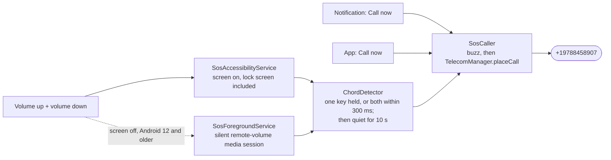

# user-mobile-app: the citizen's legal aid app

An Android app (Expo SDK 57, React Native 0.86) for the people the District Legal Aid Office
serves. In Bangla or English, one at a time:

- **SOS.** Press volume up and volume down together and the phone buzzes and calls
  **+19788458907**. This works from any screen, over other apps and on the lock screen. A
  foreground service keeps SOS armed after the app is closed and after a restart.
- **File a case.** A five-step form (who needs help, about them, what happened, safety,
  check and send) posts to the backend. With no network, the application waits on the phone
  and is sent later.
- **My cases.** Cases filed here, and cases filed by phone or at a Union Digital Centre,
  added by their 8-digit tracking number.
- **Case progress.** The stage as steps a citizen understands, the next court hearing or
  mediation meeting with a countdown, and the route the office chose (advice, mediation or
  extra care). The whole summary can be read aloud.
- **Documents.** Photos or PDFs sent to the office, and its list of the papers it still needs.
- **Help.** The 16430 hotline and 999, the AI helpline as a chat, mediation notice numbers,
  and short answers about legal aid.

A citizen has no account. A case is theirs because they hold its tracking number, which
reveals only the case's stage and next dates (`server/app/services/case_status.py`). What
the app keeps (cases, drafts, settings) stays on the phone.

## Run it

It is a **development build** (`expo-dev-client`), not Expo Go: the SOS module is native
code.

```bash
npm install
npx expo run:android          # builds, installs on the emulator or phone, starts Metro
# later, for JavaScript changes only:
npm start                     # Metro for the installed development build
```

The app talks to the DLAS backend (`server/`). The address is set when Metro bundles the
app, and the person can change it in **Settings**.

| Where the app runs | Backend address |
| --- | --- |
| Android emulator, backend on this computer | `http://10.0.2.2:8000` (the default) |
| A phone on the same Wi-Fi | `http://<this computer's LAN IP>:8000`, with the backend started with `--host 0.0.0.0` |
| Anywhere | the ngrok address `start.sh` prints |

```bash
EXPO_PUBLIC_API_URL=http://192.168.1.20:8000 npm start   # a different default
EXPO_PUBLIC_API_TOKEN=...                                  # if the backend has an API_TOKEN
```

A debug build allows plain `http://`. A release build needs the backend on `https://`.

## SOS



The native side is a local Expo module, [`modules/sos-gesture`](modules/sos-gesture):

| Part | What it does |
| --- | --- |
| `SosAccessibilityService` | Filters key events, so it sees the volume keys over any app and on the lock screen. It reads only the two volume keys, sees no screen content, and never consumes a key, so the volume still works |
| `SosForegroundService` | Foreground service of type `specialUse`: a lasting notification ("SOS is on", with **Call now** and **Turn off**) that keeps the process alive. On Android 12 and older it also hears the volume keys while the screen is off |
| `SosBootReceiver` | Turns SOS back on after a restart or an app update, if it was on |
| `ChordDetector` | The gesture itself, in pure Kotlin with JUnit tests |
| `SosCaller` | Places the call through Telecom, which works from the background and over the lock screen. Without the phone permission it opens the dialer with the number filled in |
| `app.plugin.js` | Writes the number from `app.json` into the manifest, where the services read it |

The number is set once, in `app.json`:

```json
["./modules/sos-gesture/app.plugin.js", { "number": "+19788458907" }]
```

After changing it, run `npx expo prebuild --clean` and rebuild.

**What SOS needs.** The SOS tab lists each item and how to fix it:

- **The phone-call permission.** SOS asks for it when turned on.
- **Notifications** (Android 13+).
- **The volume-button shortcut.** Settings → Accessibility → *Legal Aid SOS* → on. Android
  shows its standard warning for any accessibility service.

**Limits, all set by Android:**

- **With the screen off (Android 13 and newer), no app receives volume keys.** The
  media-session route is ignored unless the session really plays audio. We checked on an
  Android 15 emulator: the system logs "Ignoring session=…". So the screen must be on: press
  the power button once, then the volume buttons. The lock screen counts, and a PIN-locked
  phone calls without being unlocked. On Android 12 and older the screen-off session works.
- **Force-stopping the app** (Settings → Apps → Force stop) makes Android switch off its
  accessibility service. The SOS tab then shows the shortcut as needed again.
- **At the top or bottom of the volume range**, the phone still sees both presses: the
  accessibility service reads keys, not volume changes.

**Testing it on an emulator.** `adb shell input keyevent` and `input keycombination` inject
their events, and Android does not pass injected keys through accessibility. Press the keys
through the input device instead (this needs `adb root`; the keyboard device may have
another number):

```bash
adb root
D=/dev/input/event13   # the "qwerty2" device: adb shell getevent -lp
adb shell "sendevent $D 1 115 1; sendevent $D 0 0 0; sendevent $D 1 114 1; sendevent $D 0 0 0; \
  sleep 0.2; sendevent $D 1 115 0; sendevent $D 0 0 0; sendevent $D 1 114 0; sendevent $D 0 0 0"
adb logcat -s SosGesture Telecom   # "SOS triggered by volumeButtons", then SET_DIALING
```

The emulator's modem is simulated, so no real call is made.

## Backend endpoints used

| Screen | Endpoint |
| --- | --- |
| File a case | `POST /intake/web` (with `client_ref`, so sending it twice files one case) |
| My cases, progress | `GET /helpline/track/{tracking number}` |
| Documents | `POST /intake/cases/{reference}/documents` (JPEG, PNG or PDF, up to 10 MB) |
| Helpline chat | `POST /helpline/conversations`, `POST /helpline/conversations/{id}/turns` |
| Mediation notice | `GET /helpline/notice/{notice number}` |
| Settings | `GET /health` |

## Checks

```bash
npm test                  # Jest (jest-expo): form rules, progress, cases, formatters, API client, a component
npm run lint              # expo lint (ESLint with React Compiler rules)
npm run typecheck         # tsc --noEmit
npx expo-doctor
cd android && ./gradlew :sos-gesture:testDebugUnitTest   # JUnit for the chord (after a prebuild)
```

## Layout

```
user-mobile-app/
  app.json                  name, package com.vanguard.legalaid, SOS number, hotline numbers
  modules/sos-gesture/      the SOS native module (Kotlin) and its config plugin
  src/app/                  screens (Expo Router)
    (tabs)/                 index (home), cases, help, sos
    case/[token].tsx        a case's progress and documents
    file.tsx  track.tsx  chat.tsx  settings.tsx
  src/components/           UI kit (large type, 48 dp targets), case pieces, district picker
  src/i18n/                 en and bn messages; dates and numbers in Bangla digits
  src/lib/                  API client, form rules, progress steps, the case list, storage
  src/state/                settings and cases (AsyncStorage)
  src/hooks/                useSos, useTheme
```

`android/` is generated (`npx expo prebuild`) and not committed. Text uses Noto Sans
Bengali, bundled, for Bangla and Latin alike.
